# CLIENTES LIGEROS LTSP-XUBUNTU
## 1. Preparar las máquinas cliente y servidor.

### Servidor.
- La primera interfaz será externa:
 - para comunicarse con internet.
 - configurarla en vbox como adaptador puente

 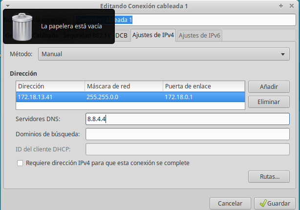

 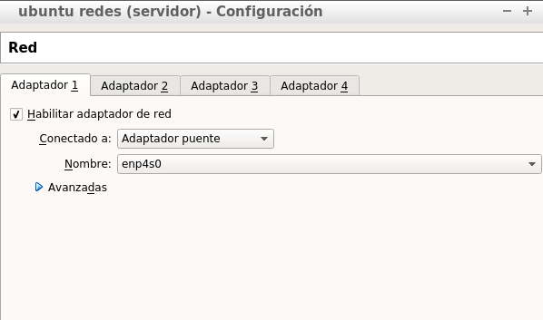

 - La segunda interfaz será la interna:
  - La ip de la interfaz de red será estática y debe estar en la misma red que los cliente
    - IP 192.168.67.1
    - Máscara de clase c

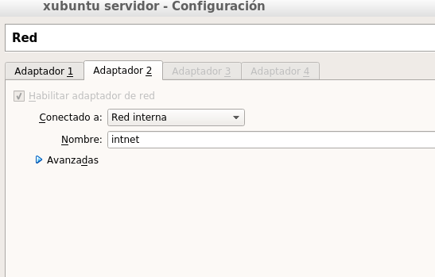

### Cliente.

Modificamos en las opciones de configuración de virtualbox.

- Sin disco duro y 1GB de RAM
- Tarjeta de red interna y PXE
- Orden de arranque en red

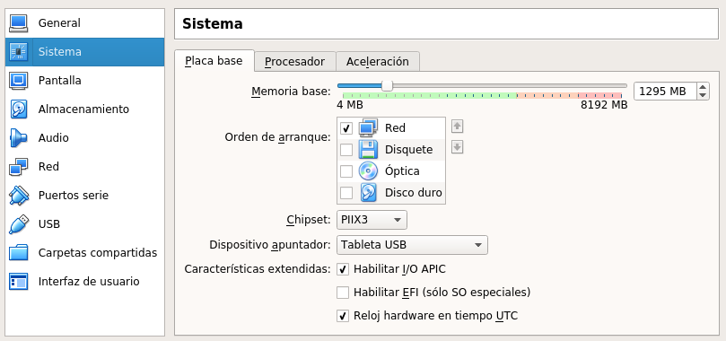

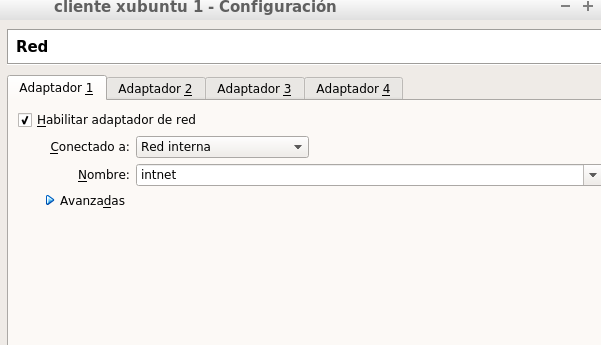

## 2. Instalación de sistema operativo xubuntu.

Instalamos el sistema operativo como cualquier ubuntu y lo configuramos con sus respectivas configuraciones.

**Comandos de comprobación.**

**Creamos los usuarios.**

Los utilizaremos más tarde para iniciar sesión en los clientes.

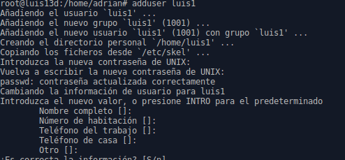

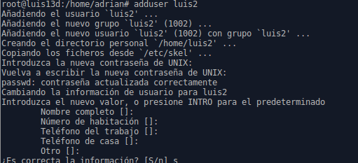

## 2.1 Instalación del openssh-server.

    apt-get install openssh-server

Modificamos el archivo /etc/ssh/sshd_config para permitir el login del usuario root.

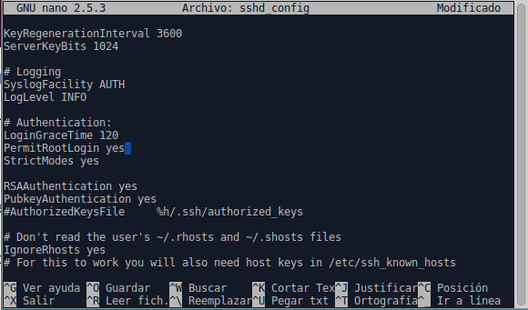

## 2.2 Instalación del servidor de clientes ligeros.

    apt-get install ltsp-server-standalone

Ejecutamos un comando para crear las imagenes para los clientes.

    ltsp-build-client

Ejecutamos ltsp-info

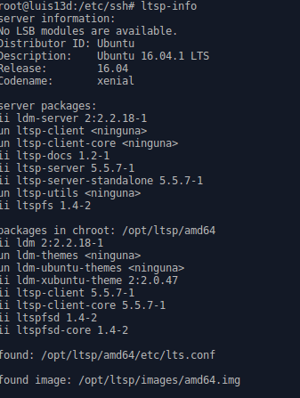

Comprobamos la configuración DHCP.

Revisar la configuración de la tarjeta de red interna del servidor. La IP estática tiene que ser compatible con la configuración DHCP.

Accedemos al fichero /etc/ltsp/dhcpd.conf.

Modificamos el rango de ip (nuestro ip estática tiene que estar dentro de ese rango) y modificamos "i386" por "amd64", si hemos creado nuestras máquinas en 64 bits.

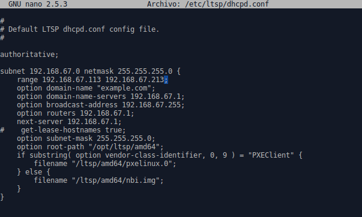

Reiniciamos nuestro servidor y comprobamos que los servicios están iniciados con systemctl status dhcp

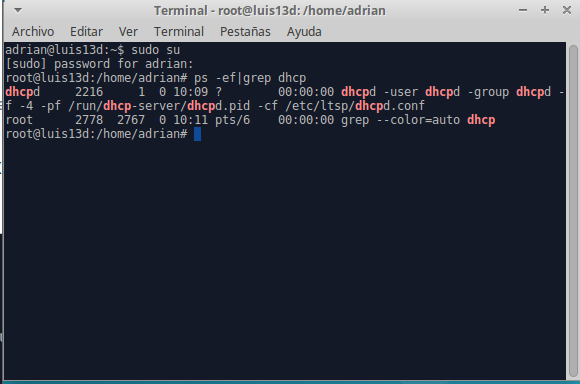

## 3. Iniciar con los clientes.

Al iniciar la máquina cliente me sale un error (pantalla dividida y sin posibilidad de iniciar sesión con ningún usuario). He comprobado con diferentes sistemas operativos (xubuntu/ubuntu(64bit)) y el error es igual en ambos.

**Capturas**

**Comandos de comprobación**

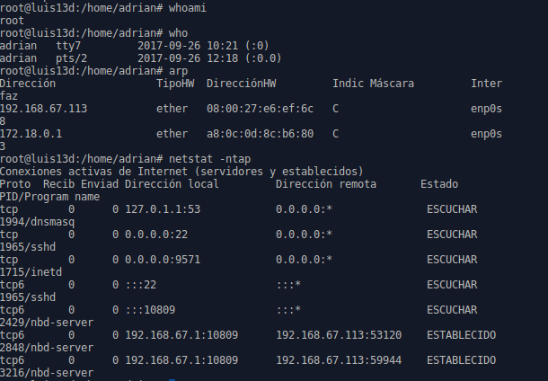
