# Conexiones remotas con VNC (OPENSUSE - WINDOWS)

## Instalación en Windows.

Configuramos la máquina con las configuraciones apropiadas.

* MAC

* IP

* Nombre de máquina

Necesitamos una máquina cliente y una servidor.

## Windows

Instalamos tightVNC Server desde la página oficial.

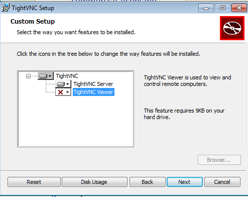

Una vez instalado nos aparecerá esta ventana y estará iniciado el servicio.

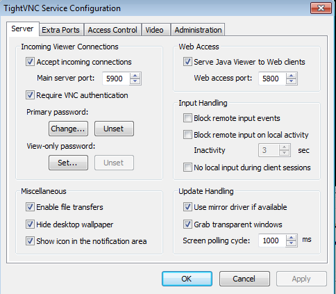

Si el servicio no esta iniciado lo podremos inciar en inicio>tightVNC>start service.

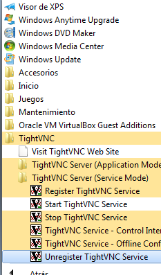

Una vez descargado e instalado iniciamos la máquina cliente e instalamos la tightVNC cliente.

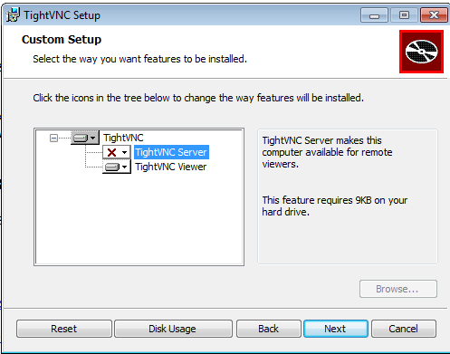

Abrimos el programa tightVNC-viewer y introducimos la ip y contraseña del tightVNC server.

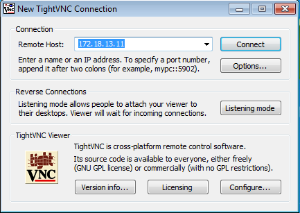

Comprobaciones :

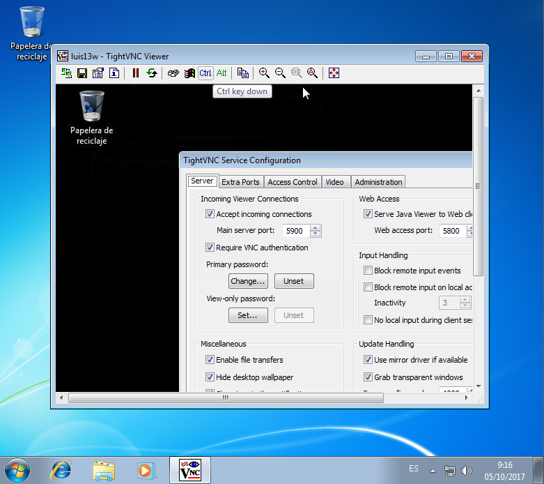

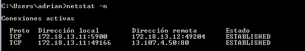

## OPENSUSE

Para instalar el servidor de vnc de opensuse nos dirigimos a yast y en el buscador escribimos vnc.

Entramos y instalamos con la siguiente configuración.

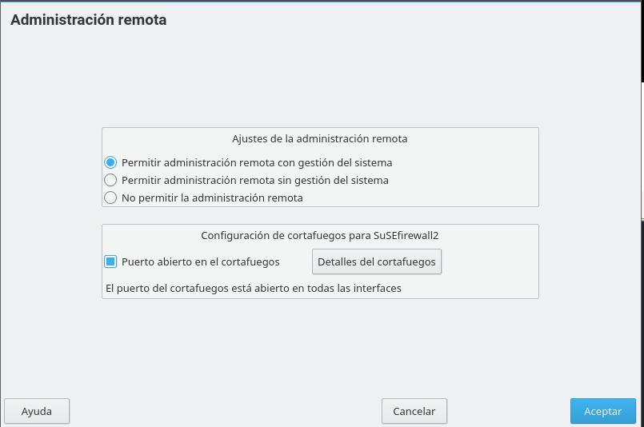

Cuando termine la instalación vamos a una terminal y ejecutamos el siguiente comando.

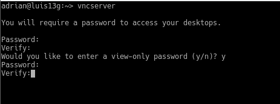

(Añadimos la contraseña que nosostros queramos.)

Ahora iniciamos nuestra máquina cliente y ejecutamos el siguiente comando para acceder al escritorio remoto.

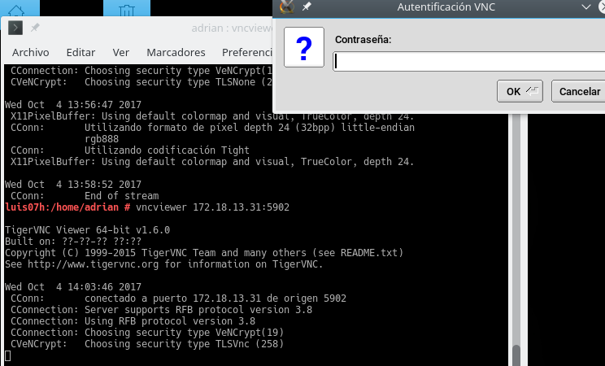

## Comprobaciones:

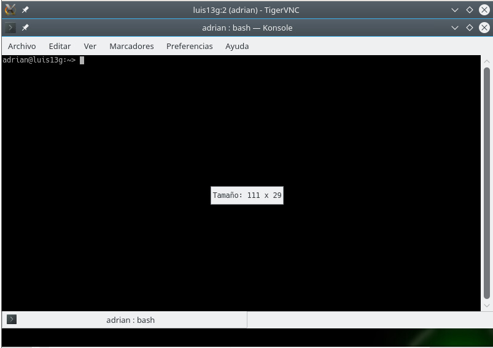

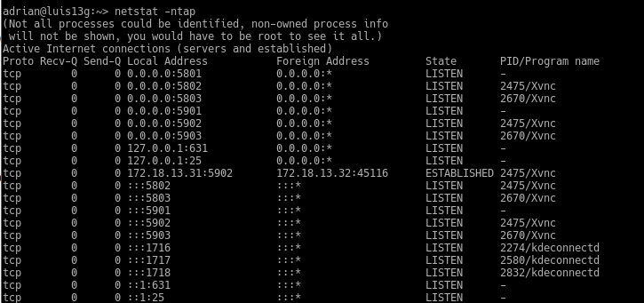

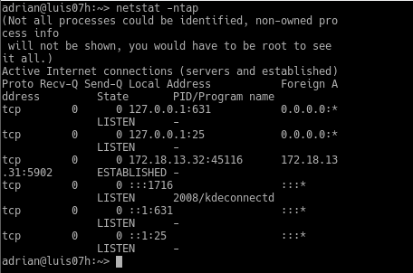

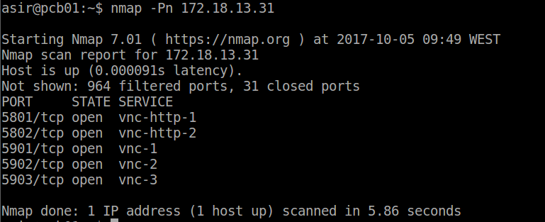

## Opensuse-Server / Windows-Cliente

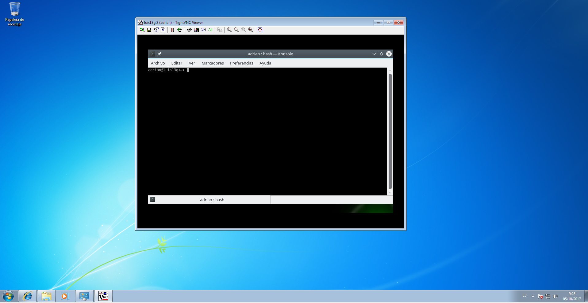

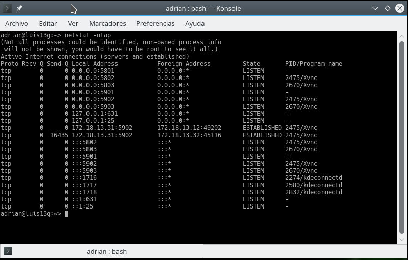

## Windows-Server / Opensuse-Cliente

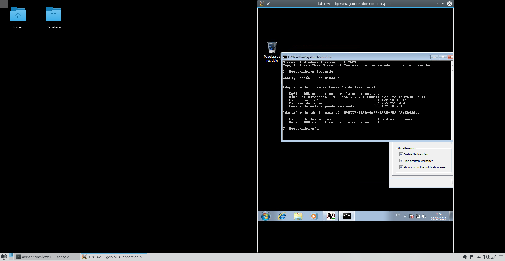

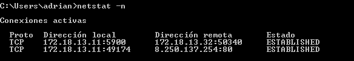
