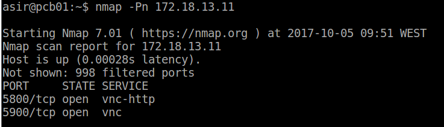

# Conexiones remotas con VNC (OPENSUSE - WINDOWS)

## Instalación en Windows.

Configuramos la máquina con las configuraciones apropiadas.

* MAC

* IP

* Nombre de máquina

Necesitamos una máquina cliente y una servidor.

## Servidor.

Instalamos tightVNC Server desde la página oficial.

Una vez instalado nos aparecerá esta ventana y estará iniciado el servicio.

Si el servicio no esta iniciado lo podremos inciar en inicio>tightVNC>start service.

Una vez descargado e instalado iniciamos la máquina cliente e instalamos la tightVNC cliente.

Abrimos el programa tightVNC-viewer y introducimos la ip y contraseña del tightVNC server.

Comprobaciones :

