# Acceso remoto SSH

Necesitamos 3 MVs:

- Un servidor GNU/Linux OpenSUSE
- Un cliente GNU/Linux OpenSUSE
- Un cliente Windows7

## 1. Preparativos

### Servidor

Configuramos el servidor con la configuración correspondiente.

Añadimos en /etc/hosts los equipos ssh-client13a y ssh-client13b.

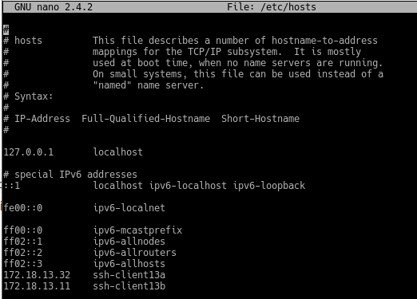

Comandos de verificación:

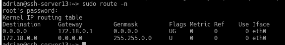

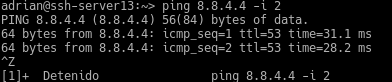

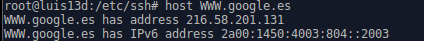

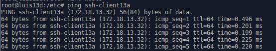

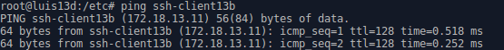

Creamos los usuarios luis1,luis2,luis3,luis4.

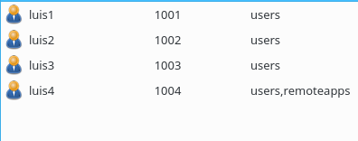

Cliente GNU/Linux

Añadimos en /etc/hosts los equipos ssh-server13 y ssh-client13b.

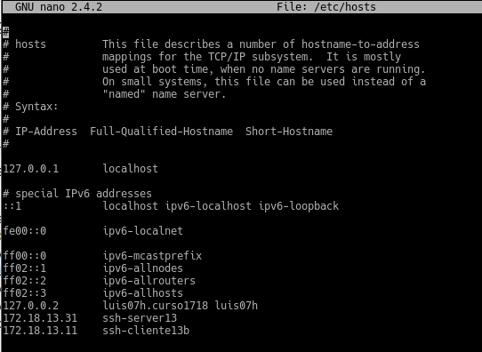

Hacemos ping a el servidor y al cliente windows.

Cliente Windows

Añadimos en C:\Windows\System32\drivers\etc\hosts los equipos ssh-server13 y ssh-client13a.

Hacemos ping a el servidor y al cliente linux.

## 2. Instalación del servicio ssh-server13

    zypper install openssh

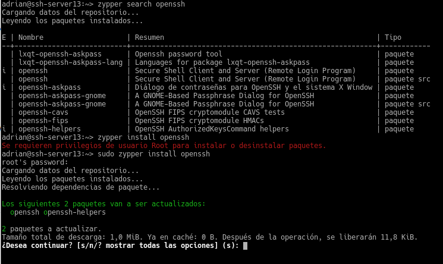

### Comprobación

Comprobamos que el servidor está encendido con systemctl status sshd.

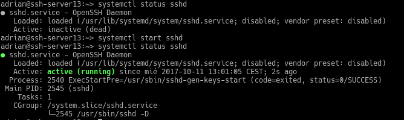

También podemos comprobarlo mirando los procesos del sistema con ps -ef|grep sshd.

Hacemos ping al servidor y utilizamos el comando nmap(si no lo tenemos los instalamos con zypper install nmap) para ver en que puerto está escuchando el servidor ssh(puerto 22 por defecto).

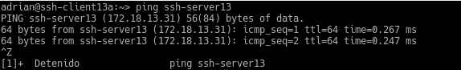

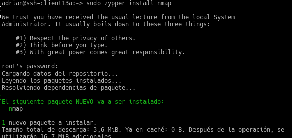

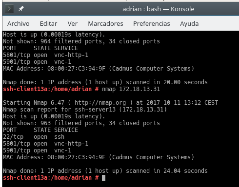

Si no aparece el ssh tendriamos que configurar el cortafuegos.
Añadiendo en la zona externa el servidor ssh.

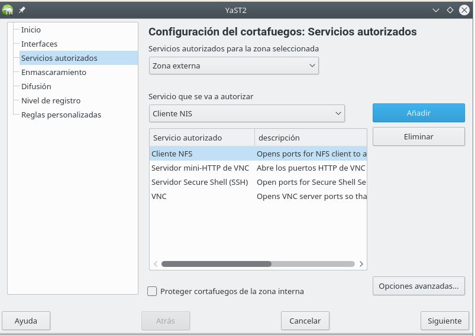

Comprobamos que el servicio está escuchando en el puerto 22

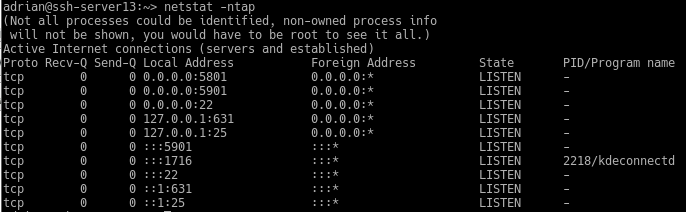
