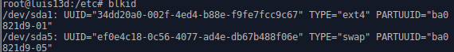
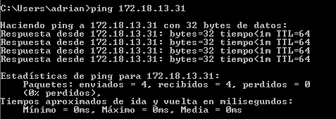

# Acceso remoto SSH

Necesitamos 3 MVs:

- Un servidor GNU/Linux OpenSUSE
- Un cliente GNU/Linux OpenSUSE
- Un cliente Windows7

## 1. Preparativos

### Servidor

Configuramos el servidor con la configuración correspondiente.

Añadimos en /etc/hosts los equipos ssh-client13a y ssh-client13b.

Comandos de verificación:

Creamos los usuarios luis1,luis2,luis3,luis4.

Cliente GNU/Linux

Añadimos en /etc/hosts los equipos ssh-server13 y ssh-client13b.

Hacemos ping a el servidor y al cliente windows.

Cliente Windows

Añadimos en C:\Windows\System32\drivers\etc\hosts los equipos ssh-server13 y ssh-client13a.

Hacemos ping a el servidor y al cliente linux.

## 2. Instalación del servicio ssh-server13

    zypper install openssh

### Comprobación

Comprobamos que el servidor está encendido con systemctl status sshd.

También podemos comprobarlo mirando los procesos del sistema con ps -ef|grep sshd.

Hacemos ping al servidor y utilizamos el comando nmap(si no lo tenemos los instalamos con zypper install nmap) para ver en que puerto está escuchando el servidor ssh(puerto 22 por defecto).

Si no aparece el ssh tendriamos que configurar el cortafuegos.
Añadiendo en la zona externa el servidor ssh.

Comprobamos que el servicio está escuchando en el puerto 22

### Conexión ssh

#### Cliente 1(linux)

Nos conectamos desde el client1 al servidor mediante ssh luis1@ssh-server13

$HOME/.ssh/known_hosts

#### Cliente 2(windows)

## 3. Cambiamos las claves del servidor

Nos dirigimos a /etc/ssh

Modificamos el fichero sshd_config y dejamos una única linea : HostKey /etc/ssh/ssh_host_rsa_key,  las demás lineas que tengan HostKey la comentamos.

### Regenerar certificados

Vamos a renovar las claves públicas/privadas de nuestro servidor.

Nos dirigimos a ssh-server y escribimos el siguiente comando:

    ssh-keygen -t rsa -f /etc/ssh/ssh_host_rsa_key

(No añadimos ninguna contraseña)

Reiniciamos el servicio ssh-keygen y comprobamos que está activo una vez reiniciado.

## 4. Personalizar prompt Bash

Cambiamos el prompt de luis1 en /home/luis1/.bashrc al iniciar sesión por ssh.

Creamos un alias en /home/luis1/.alias y ponemos los siguiente

#### Comprobación:

## 5. Autenticación mediante claves públicas

Iniciamos sesión con el usuario adrian y ejecutamos ssh-keygen -t rsa.

Ahora copiamos la clave pública del usuario adrian de la máquina ssh-client13a con ssh-copy-id

#### Comprobación:

#### Linux

Entra directamente sin pedir contraseña.

#### Windows

Entra y necesitas la contraseña.

## 6. Uso de SSH como túnel para X

Instalamos una aplicación para probar el ssh como túnel en este caso geany.

Modificamos el fichero /etc/ssh/sshd_config *X11Fordwarding yes* para permitir la ejecución de aplicaciones gráficas.

Ahora en el client13a comprobamos que geany no está instalado.

Comprobamos que funciona.

## 7. Aplicaciones Windows nativas

Instalamos wine en el ssh-server13

    zypper install wine

Utilizamos el notepad como ejemplo.

## 8. Restricciones de Uso

### Restricción sobre un usuario

Nos dirigimos al fichero /etc/ssh/sshd_config del servidor SSH y denegamos el usuario luis2.

Comprobamos que no puede iniciar sesión con el usuario luis2.

### Restricción sobre una aplicación

Creamos un grupo llamado remoteapps y incluimos el usuario luis4 dentro del grupo.

Cambiar el grupo propietario de geany a remoteapps y añadimos los permisos para que los demás usuarios que no pertenezcan al grupo remoteapps no puedan utilizar geany.

#### Comprobación:

