# Instalación y configuración de servidor Samba

Necesitaremos las siguientes MVs:

* MV1: Un servidor GNU/Linux OpenSUSE con IP estática 172.18.13.31.

* MV2: Un cliente GNU/Linux OpenSUSE con IP estática 172.18.13.32.

* MV3: Un cliente Windows con IP estática 172.18.13.11.

## 1. Servidor Samba (MV1)

### 1.1 Preparativos

Comandos de comprobación:

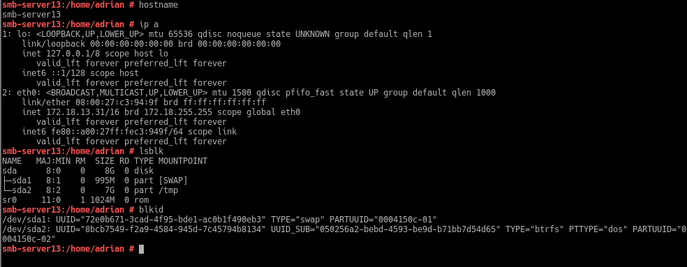

### 1.2 Usuarios locales

Creamos los grupos *piratas*, *soldados* y *todos*. Creamos los usuarios *pirata1*, *pirata2*, *supersamba* (los añadimos al grupo *piratas*), *soldado1*, *soldado2* (los añadimos al grupo *soldados* junto con *supesamba*) y añadimos al grupo *todos* los usuarios que hemos creado anteriormente y el *smbguest*.

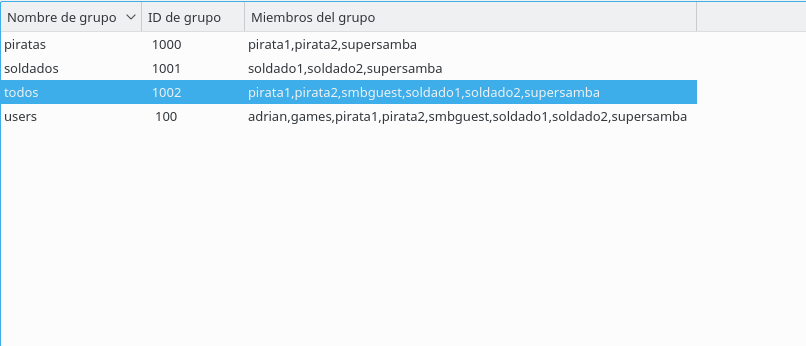

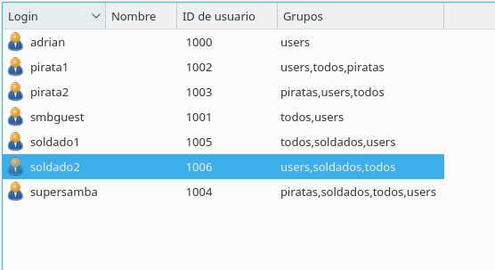

Ponemos los usuarios de samba dentro del grupo cdrom.

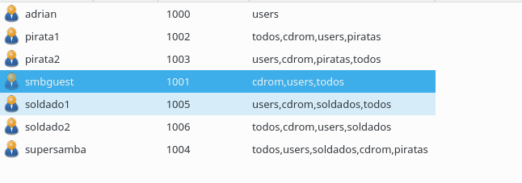

Creamos el usuario smbguest y modificamos la shell (/bin/false).

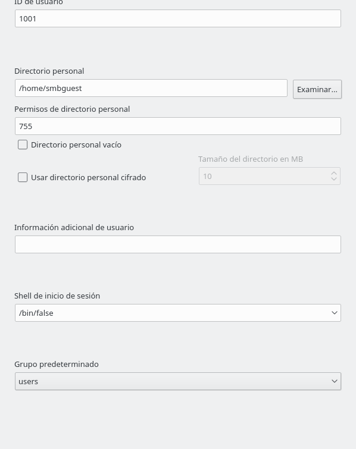

### 1.3 Crear las carpetas para los futuros recursos compartidos.

* Creamos la carpeta public.d con usuario propietario supersamba, grupo propietario todos y permisos 775.

* Creamos la carpeta castillo.d con usuario propietario supersamba, grupo propietario soldados y permisos 770.

* Creamos la carpeta barco.d con usuario propietario supersamba, grupo propietario piratas y permisos 770.

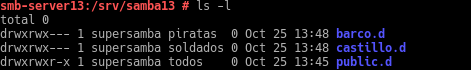

### 1.4 Configurar el servidor Samba

**Antes de cambiar la configuración hacemos una copia de seguridad del fichero de configuración**

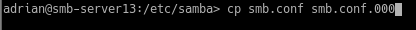

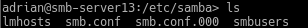

Accedemos al yast y buscamos samba. Seguimos los pasos de la instalación.

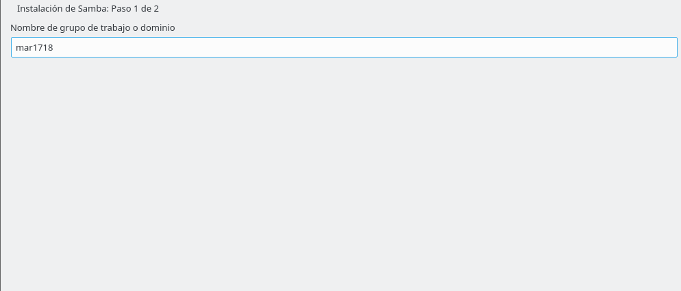

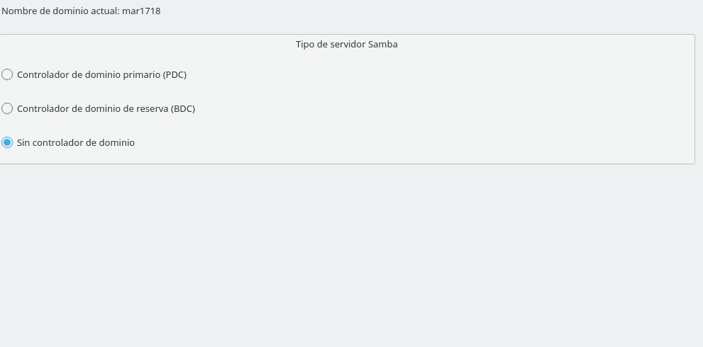

Habilitamos el puerto de samba en el cortafuegos y el arranque automatico al iniciar la máquina.

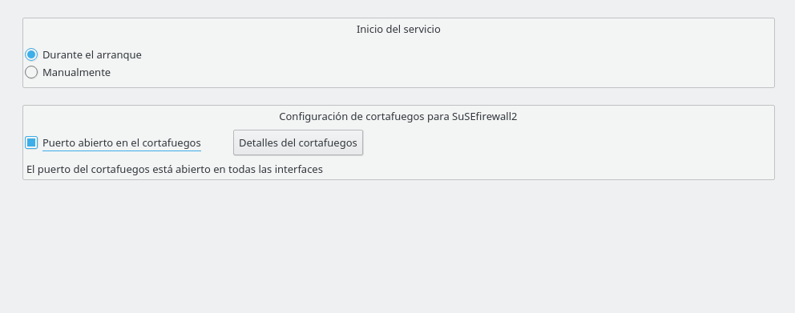

### 1.5 Crear los recursos compartidos de Samba

Nos dirigimos al fichero de configuración :

    /etc/samba.smb.conf

Añadimos los recursos global,cdrom,public,castillo,barco con sus respectivas configuraciones.

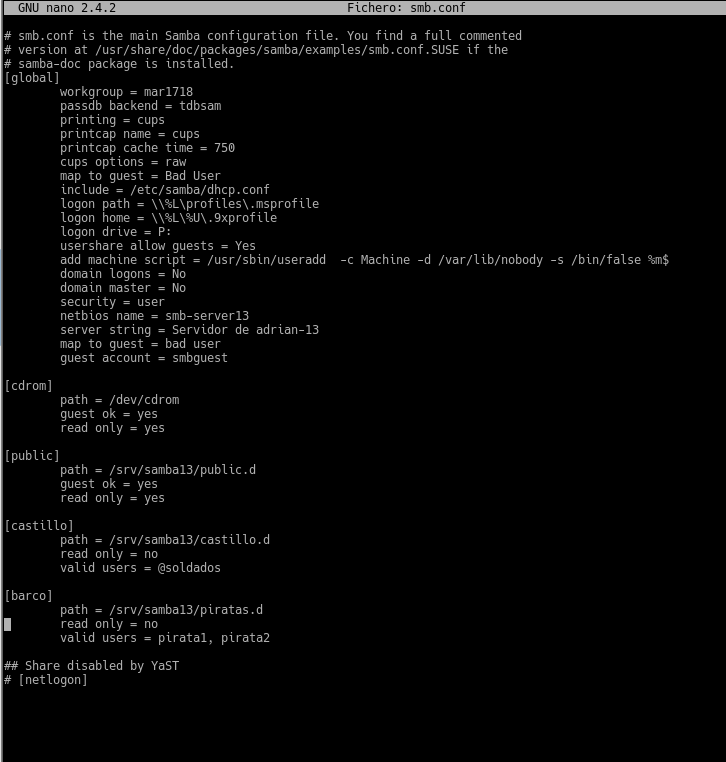

**Comprobamos los resultados:**

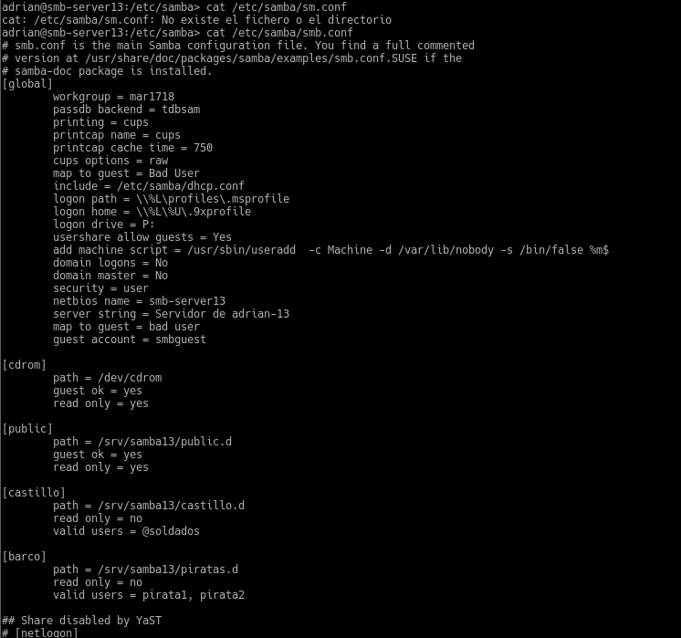

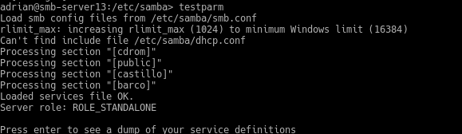

### 1.6 Usuarios Samba

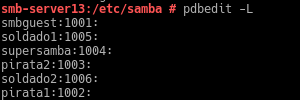

### 1.7 Reiniciar

Reiniciamos los servicios smb y nmb :

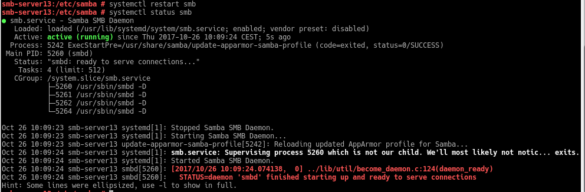

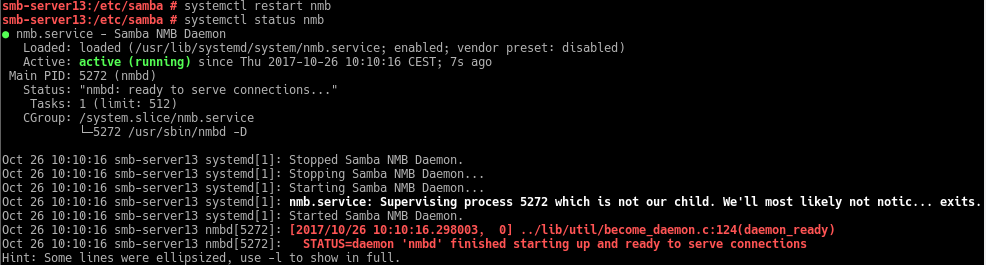

Comandos de comprobación :

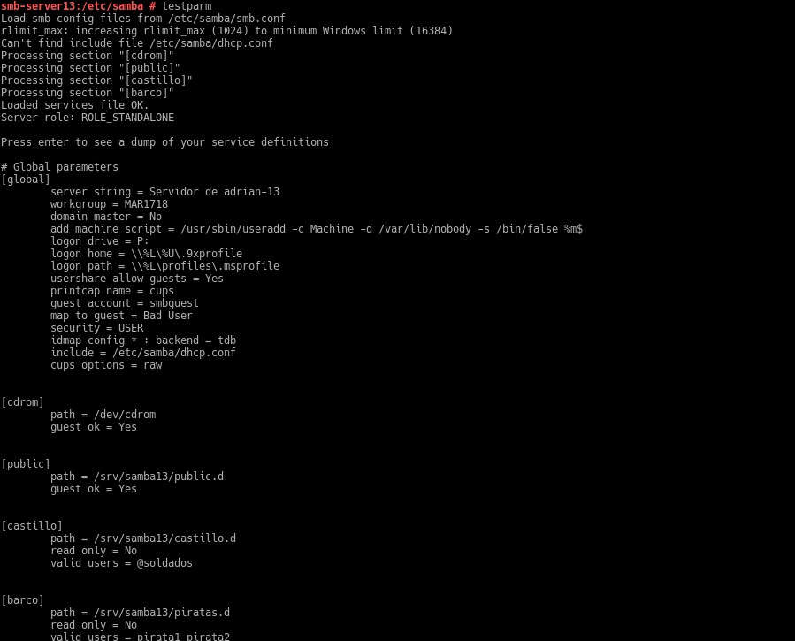

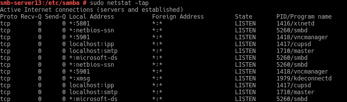

## 2. Windows (MV3 smb-cli13b)

Configuramos el cliente Windows.(\etc\hosts)

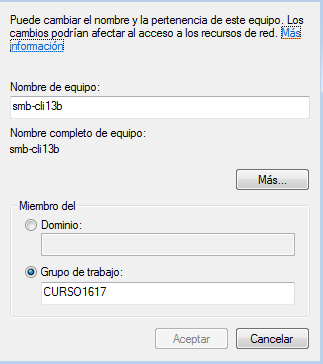

### 2.1 Cliente Windows GUI

Accedemos a nuestro servidor desde "Red" - "\\ip-servidor"

Comandos de comprobación:

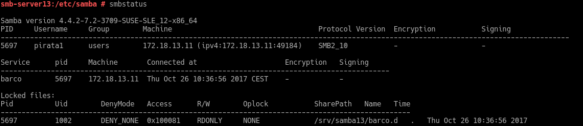

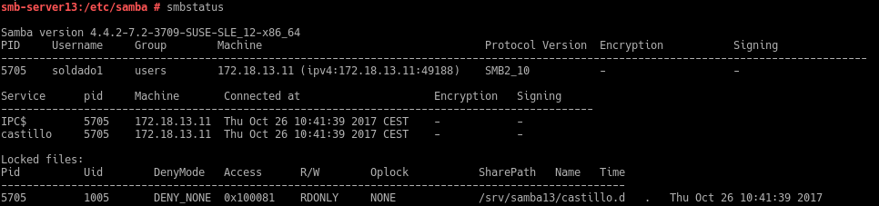

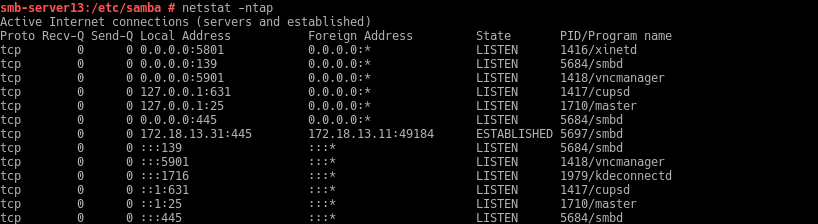

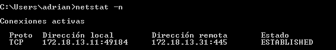

### 2.2 Cliente Windows comandos

Comandos de comprobación:

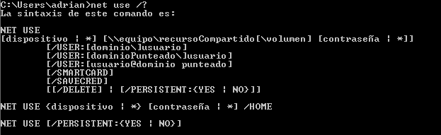

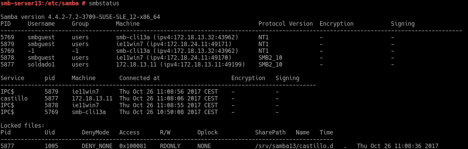

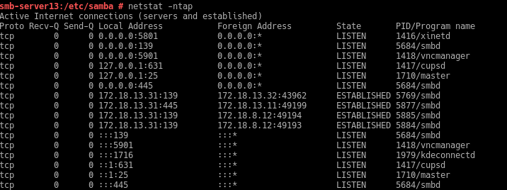

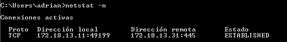

## 3. Cliente GNU/Linux (MV2 smb-cli31a)
