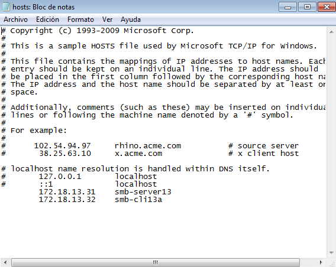
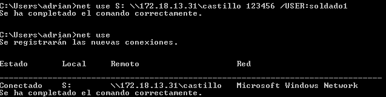
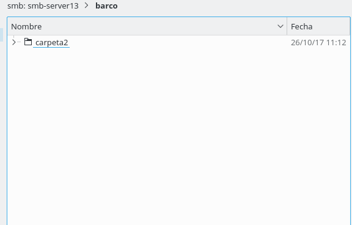
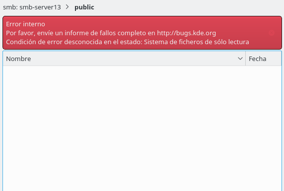

# Instalación y configuración de servidor Samba

Necesitaremos las siguientes MVs:

* MV1: Un servidor GNU/Linux OpenSUSE con IP estática 172.18.13.31.

* MV2: Un cliente GNU/Linux OpenSUSE con IP estática 172.18.13.32.

* MV3: Un cliente Windows con IP estática 172.18.13.11.

## 1. Servidor Samba (MV1)

### 1.1 Preparativos

Comandos de comprobación:

### 1.2 Usuarios locales

Creamos los grupos *piratas*, *soldados* y *todos*. Creamos los usuarios *pirata1*, *pirata2*, *supersamba* (los añadimos al grupo *piratas*), *soldado1*, *soldado2* (los añadimos al grupo *soldados* junto con *supesamba*) y añadimos al grupo *todos* los usuarios que hemos creado anteriormente y el *smbguest*.

Ponemos los usuarios de samba dentro del grupo cdrom.

Creamos el usuario smbguest y modificamos la shell (/bin/false).

### 1.3 Crear las carpetas para los futuros recursos compartidos.

* Creamos la carpeta public.d con usuario propietario supersamba, grupo propietario todos y permisos 775.

* Creamos la carpeta castillo.d con usuario propietario supersamba, grupo propietario soldados y permisos 770.

* Creamos la carpeta barco.d con usuario propietario supersamba, grupo propietario piratas y permisos 770.

### 1.4 Configurar el servidor Samba

**Antes de cambiar la configuración hacemos una copia de seguridad del fichero de configuración**

Accedemos al yast y buscamos samba. Seguimos los pasos de la instalación.

Habilitamos el puerto de samba en el cortafuegos y el arranque automatico al iniciar la máquina.

### 1.5 Crear los recursos compartidos de Samba

Nos dirigimos al fichero de configuración :

    /etc/samba.smb.conf

Añadimos los recursos global,cdrom,public,castillo,barco con sus respectivas configuraciones.

**Comprobamos los resultados:**

### 1.6 Usuarios Samba

### 1.7 Reiniciar

Reiniciamos los servicios smb y nmb :

Comandos de comprobación :

## 2. Windows (MV3 smb-cli13b)

Configuramos el cliente Windows.(\etc\hosts)

### 2.1 Cliente Windows GUI

Accedemos a nuestro servidor desde "Red" - "\\ip-servidor"

Comandos de comprobación:

### 2.2 Cliente Windows comandos

Comandos de comprobación:

## 3. Cliente GNU/Linux (MV2 smb-cli31a)

Configuramos la máquina con el nombre smb-cli13a y añadimos en el fichero hosts las demás máquinas que utilizamos en la practica.

### 3.1 Cliente GNU/Linux GUI

Creamos carpetas/archivos en castillo y en barco.

**castillo**

**barco**

Comprobamos que el recurso public es de sólo lectura.

Comandos de comprobación:

### 3.2 Cliente GNU/Linux Comandos

Comprobamos el uso de la siguientes herramientas:

Creamos la carpeta castillo y la montamos.

Comandos de comprobación:

### 3.3 Montaje automático

Para que se monte automáticamente necesitamos ir a **/etc/fstab** y escribir la siguiente línea.

Reiniciamos la máquina y comprobamos que ya tenemos montada la carpeta al iniciar.

### 4. Preguntas para resolver

* ¿Las claves de los usuarios en GNU/Linux deben ser las mismas que las que usa Samba?

No, es recomendable que sean diferentes para aumentar la seguridad de nuestro servidor.

* ¿Puedo definir un usuario en Samba llamado soldado3, y que no exista como usuario del sistema?

No necesitamos que esté creado en el sistema para poder logearnos con los usuarios que hemos enlazado al samba.Lo que si se puede hacer es denegar el usuario para que solo pueda entrar al samba y no al sistema.

* ¿Cómo podemos hacer que los usuarios soldado1 y soldado2 no puedan acceder al sistema pero sí al samba? (Consultar /etc/passwd)

Añadiendo en yast o en /etc/passwd la shell como /bin/false del usuario que queramos degenar el inicio en el sistema.

* Añadir el recurso [homes] al fichero smb.conf según los apuntes. ¿Qué efecto tiene?

Creamos un recurso compartido llamado *homes* que incluirá configuración sobre ese recurso compartido en concreto. (El fichero está en /etc/samba/smb.conf)
