# Servicio de directorio - LDAP - OpenSuse

## 1. Instalación del Servidor LDAP

Instalamos los paquetes necesarios para la instalación de LDAP.

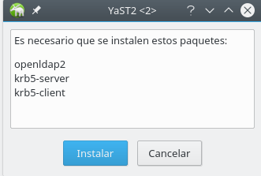

Vamos a yast y abrimos el servidor de autenticación.

Añadimos las siguientes configuraciones:

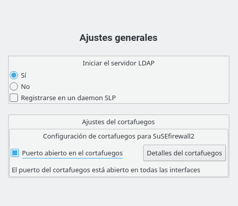

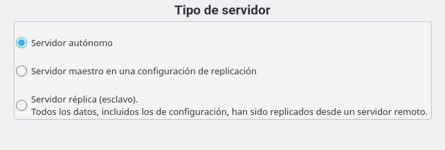

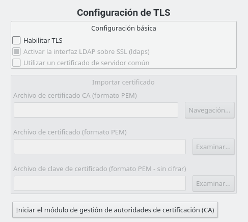

Añadimos el DN base y el administrador como en la captura.

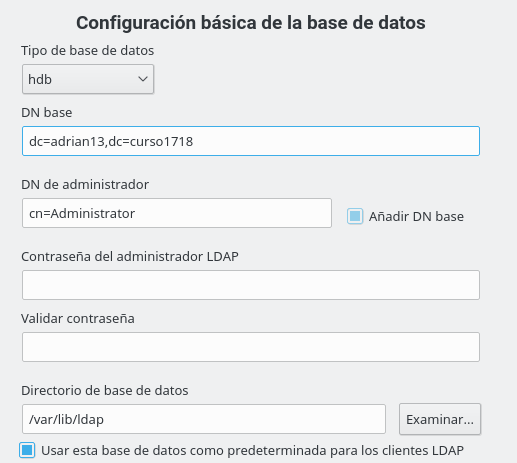

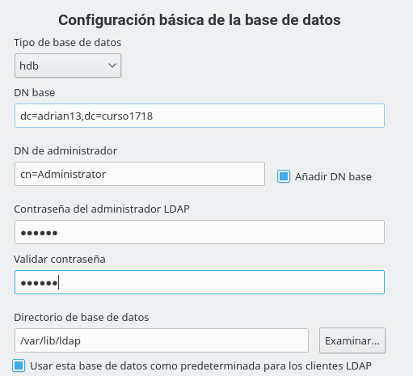

No habilitamos la autenticación por kerberos (más adelante lo activaremos).

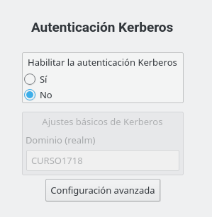

Cuando realicemos todos los pasos la configuración quedaría de la siguiente manera.

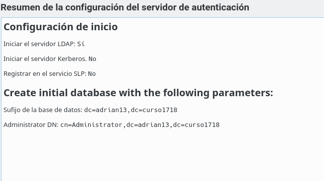

Comprobaciones:

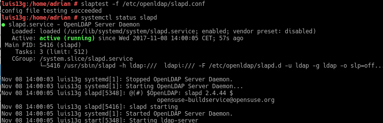

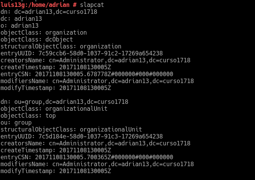

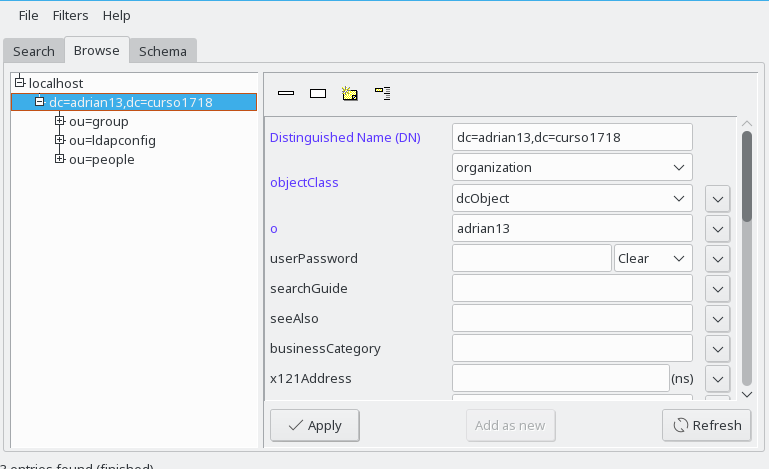

## 2. Crear usuarios y grupos LDAP

Añadimos el filtro LDAP en  Usuarios y grupos. Creamos un grupo llamado piratas2 y le añadimos los usuarios pirata21 y pirata22 que hemos creado previamente.

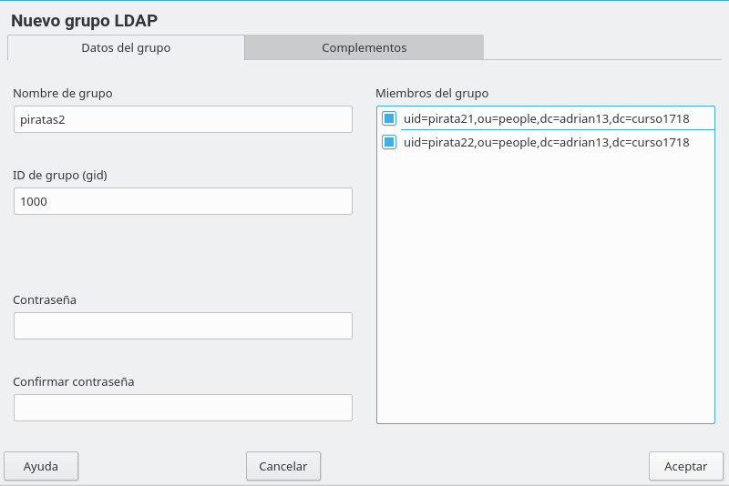

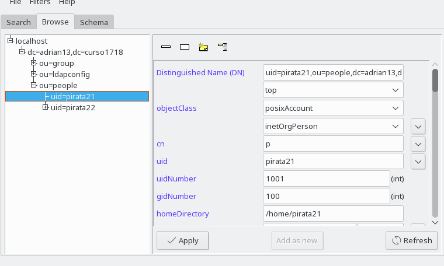
