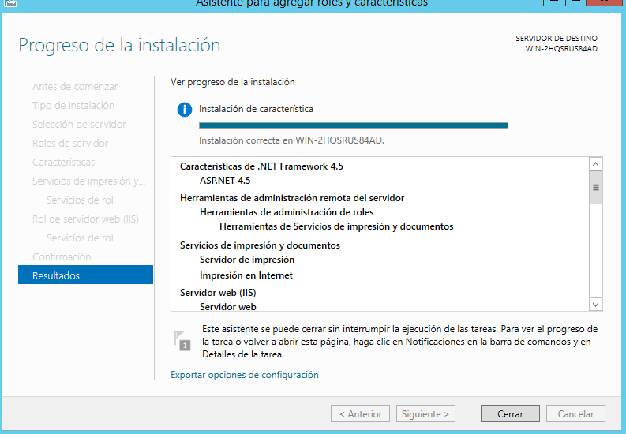

# Servidor de Impresión en Windows

## 1. Impresora compartida
### 1.1 Rol impresión

Instalamos rol/función de servidor de impresión en el servidor.
(Incluimos la impresión por internet)

Agregamos la características servicios de impresión y documentos.

Seleccionamos los servicios de rol:

- Servidor de impresión
- Impresión en internet

Tambien en los servicios de roles añadimos el servidor web.

### 1.2 Instalar impresora PDF

Instalamos PDFCreator de la página oficial . www.pdfcreator.es. Este programa no tiene autosave, pero tiene una carpeta por defecto para guardar los pdf que es Documentos.

### 1.3 Probar la impresora en local

Para probar la "impresora local" creamos un archivo con un editor de texto por ejemplo bloc de notas.

Después de "imprimir" el archivo se nos abre el PDFCreator para que digamos donde queremos guardar el pdf. Por defecto se abre en documentos.

Y una vez guardado automaticamente se nos abre el PDFcreator para mostrarnos el pdf.

### 1.4 Compartir por red

Compartimos la impresora en panel de control -> Dispositivos e impresoras  y la buscamos y la compartimos (botón derecho-> propiedades -> Compartir)

En el cliente buscamos el recurso de red del servidor \\172.18.13.22

Nos conectamos:

botón derecho -> conectar

## 2. Acceso web

No necesitamos instalar las características de impresión Web porque ya la hemos instalado previamente.

### 2.1 Configurar impresión web

En el cliente accedemos a la siguiente dirección web http://luis13s/printers y nos aparecerá un entorno para gestionar las impresora (cola de impresión, configuración...)

Para imprimir desde la red en esa impresora compartida utilizando la URL debemos seguir los siguientes pasos:

En propiedades copiamos el link *Nombre de red*

Después agregamos la impresora.

Panel de control -> dispositivos e impresión -> añadir impresora.

Seleccionamos una impresora compartida por nombre(Añadimos la URL que hemos copiado anteriormente):

Una vez echo esto se nos quedará dos impresoras enlazadas que en realidad es la misma pero enlazada de dos maneras diferentes (Una por recursos compartidos y la otra por impresora en red - URL)

### 2.2 Comprobar desde el navegador

Para realizar la prueba primero pausamos todos los trabajos que está realizando la impresora. Y añadimos un documento a "imprimir" .

Reanudamos la cola de impresión.

Y nos deberia aparecer el archivo abierto como pdf en el servidor o si usastes PDFcreator estará guardado en la carpeta documentos.

