# Actividad 2: Docker

## 1. Instalación y primeras pruebas.

Ejecutamos como superusuario los siguientes comandos:

~~~
zypper in docker              # Instala docker
systemctl start docker        # Inicia el servicio
                              # "docker daemon" hace el mismo efecto
docker version                # Debe mostrar información del cliente y del servidor
usermod -a -G docker USERNAME # Añade permisos a nuestro usuario
~~~

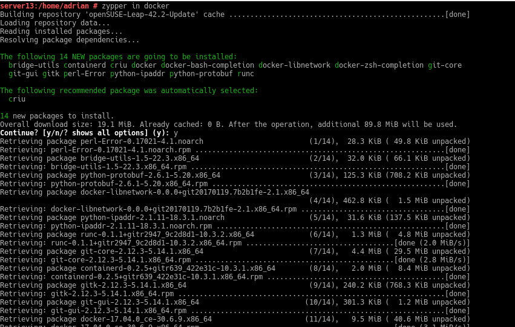

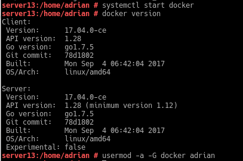

Salimos de la sesión actual y volvemos a entrar.

Ejecutamos con nuestro usuario los siguientes comandos.

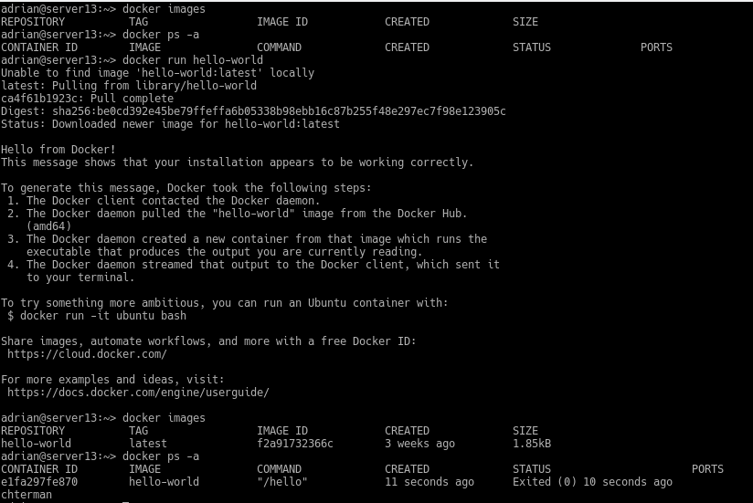

## 2. Configuración de la red

Habilitar el acceso a la red externa a los contenedores.

En yast -> Dispositivos de red -> Encaminamiento -> Habilitar reenvío IPv4

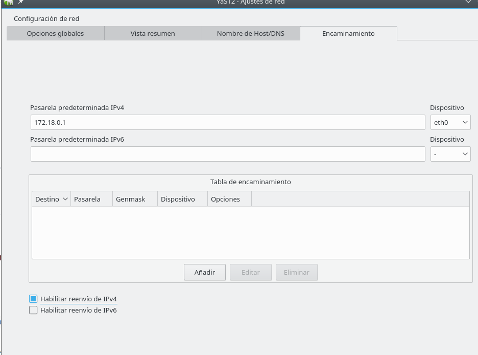

Cuando la red está gestionada por Network Manager, en lugar de usar YaST debemos editar el fichero /etc/sysconfig/SuSEfirewall2 y poner FW_ROUTE="yes".

## 3. Crear una imagen manualmente

Utilizamos los siguientes comandos.

~~~
docker images          # Vemos las imágenes disponibles localmente
docker search debian   # Buscamos en los repositorios de Docker Hub
                       # contenedores con la etiqueta `debian`
docker pull debian:8   # Descargamos una imagen `debian:8` en local
docker images
docker ps -a           # Vemos todos los contenedores
docker ps              # Vemos sólo los contenedores en ejecución
~~~
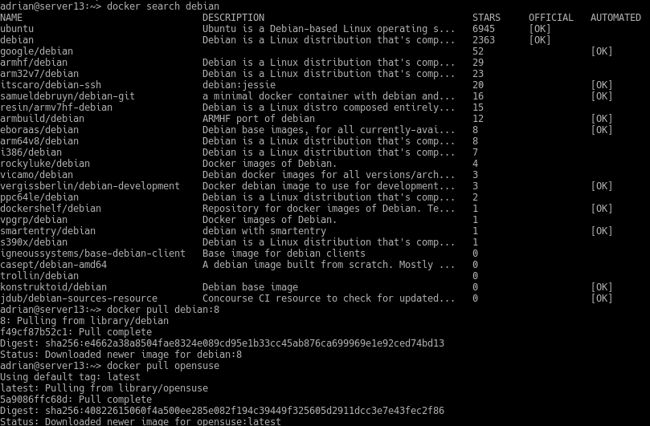

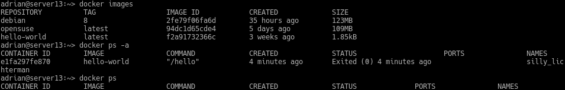

Creamos un contenedor con nombre mv_debian a partir de la imagen debian:8 y ejecutamos /bin/bash.

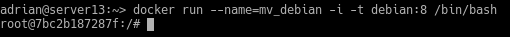

Dentro del contenedor ejecutamos los siguientes comandos.

~~~
cat /etc/motd            # Comprobamos que estamos en Debian
apt-get update
apt-get install -y nginx # Instalamos nginx en el contenedor
apt-get install -y nano   # Instalamos editor vi en el contenedor
/usr/sbin/nginx          # Iniciamos el servicio nginx
ps -ef
~~~

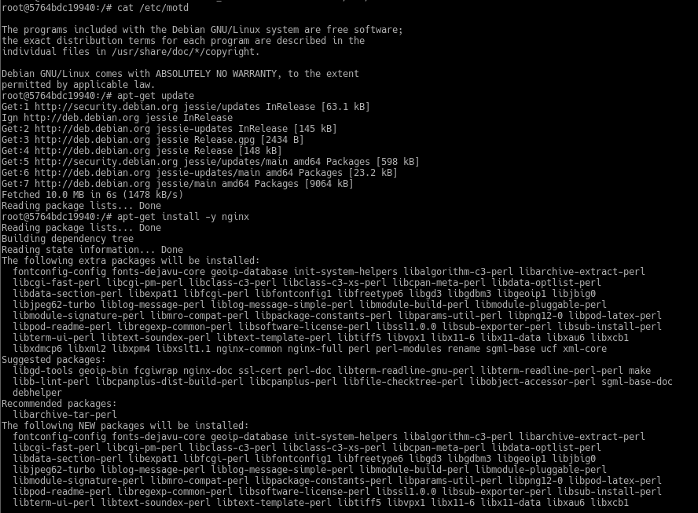

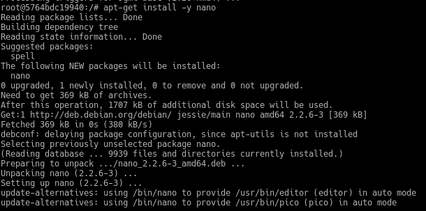

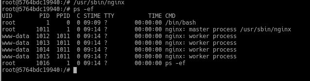

Creamos un fichero HTML (holamundo.html)

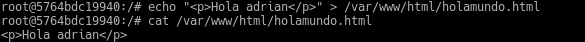

Tambien creamos un script server.sh.

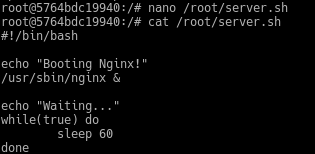

**Añadimos permisos de ejecución al script con el comando chmod +x server.sh**

Buscamos el id del contenedor con el docker ps.Aunque podemos utilizar el nombre para poder identificar el contenedor.

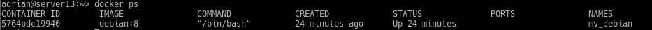

Ahora creamos una nueva imagen con los cambios que hemos realizado anteriormente al contenedor.

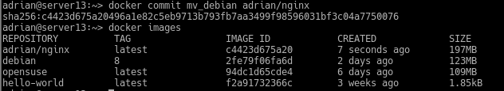

Ejecutamos los siguientes comandos para eliminar el contenedor.

~~~
docker ps
docker stop mv_debian  # Paramos el contenedor
docker ps
docker ps -a           # Vemos el contenedor parado
docker rm IDcontenedor # Eliminamos el contenedor
docker ps -a
~~~
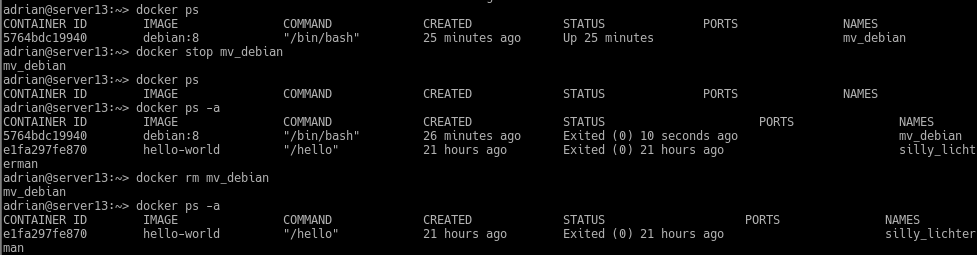

### 3.1 Crear contenedor con nginx

Iniciamos el contenedor que contiene nginx.

~~~
docker ps
docker ps -a
docker run --name=con_nginx -p 80 -t dvarrui/nginx /root/server.sh
Booting Nginx!
Waiting...
~~~

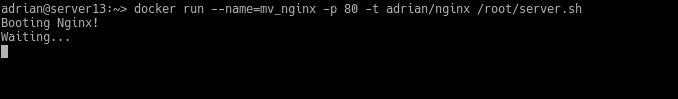

Esto significa que el script está en ejecución, abrimos una nueva terminal.
Ejecutamos docker ps, nos muestra los contenedores en ejecución y sacamos el puerto para acceder desde el navegador web.

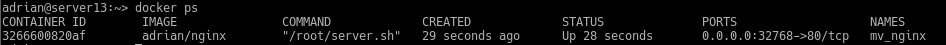

Abrimos un navegador web y ponemos localhost:32768. Accederemos a la página web del contenedor.

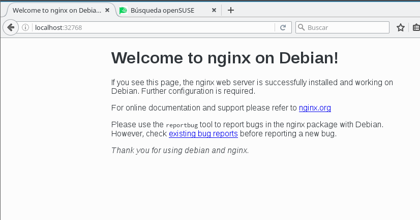

Paramos el contenedor y lo eliminamos.

~~~
docker ps
docker stop con_nginx
docker ps
docker ps -a
docker rm con_nginx
docker ps -a
~~~

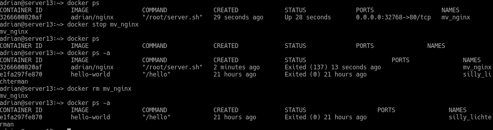

## 4. Crear un contenedor con Dockerfile

### 4.1 Preparar ficheros

Crear directorio /home/adrian/docker13 y ponemos dentro los siguientes ficheros:

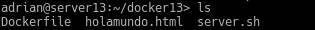

Creamos el fichero Dockerfile.

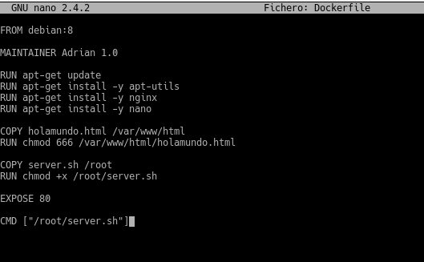

### 4.2 Crear imagen desde el Dockerfile

Ejecutamos los siguientes comandos.

~~~
cd /home/nombre-del-alumno/dockerXX # Entramos al directorio del Dockerfile
docker images                       # Consultamos las imágenes disponibles
docker build -t dvarrui/nginx2 .    # Construye imagen a partir del Dockefile
                                    # OJO el punto es necesario
docker images                       # Debe aparecer nuestra nueva imagen
~~~
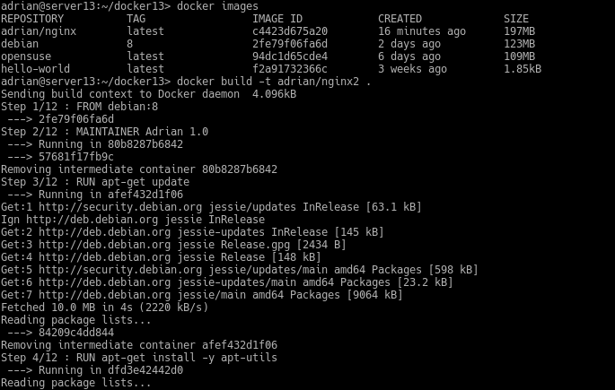

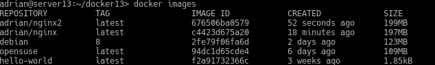

### 4.3 Crear contenedor y comprobar

Creamos un nuevo contenedor con el nombre mv_nginx2 a partir de la imagen adrian/nginx2 y ponemos que ejecute el programa server.sh.

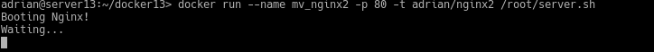

Desde otra terminal hacemos docker ps para identificar el puerto de escucha.

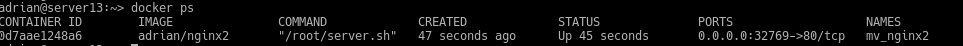

Abrimos un navegador web y comprobamos.

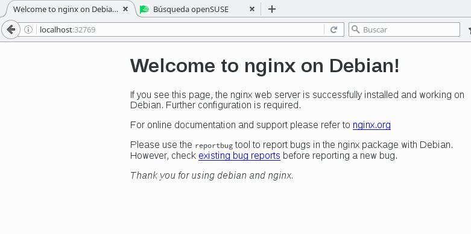

Comprobamos que podemos acceder al html que hemos creado.

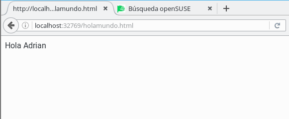

## 5. Migrar las imágenes de docker a otro servidor

Creamos una imagen de contenedor

~~~

    docker ps   # muestra los contenedores que tengo en ejecución.
    docker commit -p CONTAINERID container-backup   # grabar una imagen de nombre "container-backup" a partir del contenedor CONTAINERID.
    docker images   # comprobar que se ha creado la imagen "container-backup
~~~

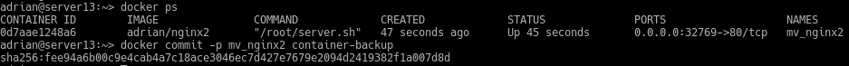

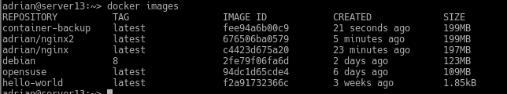

Exportamos la imagen.

~~~
docker save -o ~/container13-backup.tar container13-backup # guardamos la imagen "container-backup" en un fichero tar.
~~~
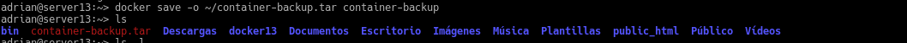

Importamos imagen docker desde el fichero.

Movemos el .tar a otra máquina con docker instalado y ejecutamos los siguientes comandos para cargarla.

~~~
docker load -i ~/containerXX-backup.tar   # cargamos la imagen docker a partir del fichero tar.
docker images   # comprobamos que la nueva imagen está disponible.
~~~

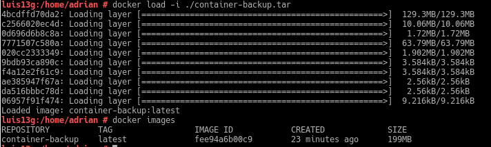
