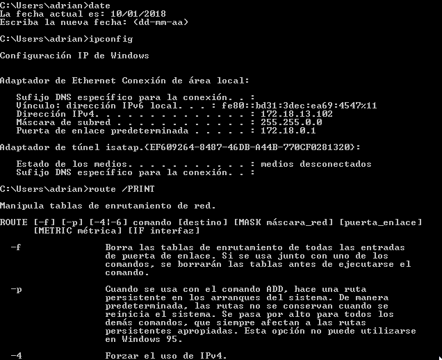

# PUPPET : Instalación en linux (master-cliente) y windows (cliente)
## 1.1 Configuración
Para la práctica necesitamos 3 MV.

**MV1(master-linux):**

IP estática 172.18.13.100

Nombre del equipo: master13

Dominio: curso1718

**MV2 (cliente-linux):**

IP estática 172.18.13.101

Nombre del equipo: cli1alu13

Dominio: curso1718

**MV3 (cliente-windows):**

IP estática 172.18.13.102

Nombre Netbios: cli2alu13

Nombre del equipo: cli2alu13

## 1.2 Configuración del archivo /etc/hosts

**GNU/Linux**

**Windows**

## 1.3 Comprobación de las configuraciones

Realizamos los siguientes comandos para comprobar si nuestra configuración es correcta.

**GNU/Linux**

**Windows**

## 2. Instalación y configuración del puppet master.

Instalamos puppet master en la MV1 master13:

zypper install rubygem-puppet-master (para opensuse leap)

Activamos el servicio puppetmaster :

    systemctl enable puppetmaster

Iniciamos el servicio puppetmaster :

    systemctl start puppetmaster

Y comprobamos el estado del servicio :

    systemctl status puppetmaster

## 2.1 Creamos el archivo site.pp.
Nos dirigimos a la siguiente ruta.
**Fichero principal de configuración de órdenes para los agentes/nodos puppet.**

 /etc/puppet/manifests/site.pp

## 2.2 Creamos el archivo hostlinux1.pp
Nos dirigimos a la siguiente ruta.
**Separaremos la configuración en distintos fichero para organizarnos mejor.**
/etc/puppet/manifests/classes

## 3. Instalación y configuración del cliente1

Instala puppet en el cliente con el siguiente comando.

    zypper install rubygem-puppet (opensuse leap)

Configuramos el siguiente fichero donde indicará quien es el equipo master.

    /etc/puppet/puppet.conf

