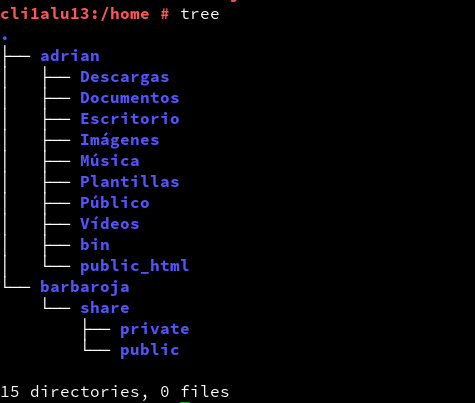

# PUPPET WINDOWS - LINUX

## 1.1 Configuración :

Para la práctica necesitamos 3 MV.

**MV1(master-linux):**

IP estática 172.18.13.100

Nombre del equipo: master13

Dominio: curso1718

**MV2 (cliente-linux):**

IP estática 172.18.13.101

Nombre del equipo: cli1alu13

Dominio: curso1718

**MV3 (cliente-windows):**

IP estática 172.18.13.102

Nombre Netbios: cli2alu13

Nombre del equipo: cli2alu13

## 1.2 Configuración del archivo /etc/hosts

**GNU/Linux**

**Windows**

## 1.3 Comprobación de las configuraciones

Realizamos los siguientes comandos para comprobar si nuestra configuración es correcta.

**GNU/Linux**

**Windows**

## 2. Instalación y configuración del puppet master.

Instalamos puppet master en la MV1 master13:

zypper install rubygem-puppet-master (para opensuse leap)

Activamos el servicio puppetmaster :

    systemctl enable puppetmaster

Iniciamos el servicio puppetmaster :

    systemctl start puppetmaster

Y comprobamos el estado del servicio :

    systemctl status puppetmaster

## 2.1 Creamos el archivo site.pp.
Nos dirigimos a la siguiente ruta.
**Fichero principal de configuración de órdenes para los agentes/nodos puppet.**

 /etc/puppet/manifests/site.pp

## 2.2 Creamos el archivo hostlinux1.pp
Nos dirigimos a la siguiente ruta.
**Separaremos la configuración en distintos fichero para organizarnos mejor.**
/etc/puppet/manifests/classes

## 3. Instalación y configuración del cliente1

Instala puppet en el cliente con el siguiente comando.

    zypper install rubygem-puppet (opensuse leap)

Configuramos el siguiente fichero donde indicará quien es el equipo master.

    /etc/puppet/puppet.conf

Comprobar que el directorio /var/lib/puppet tiene como usuario/grupo propietario puppet.

Iniciamos el servicio puppet y comprobamos que está activo.

Abrimos el cortafuegos para los servicios de puppet.

## 4. Certificados

En MV master nos logeamos como usuario root y ejecutamos los siguientes comandos:

Vemos como nos aparece el certificado a la espera.

Aceptamos el certificado al nuevo cliente desde el master.

Comprobamos que el certificado ya no está y lo utilizamos.

## 4.1 Comprobación en el cliente1

Iniciamos la máquina y comprobamos que tenemos traceroute y geany instalados. (Si lo tenemos instalado significa puppet está funcionando ya que lo hemos configurado para que instale esos programas)

## 5. Segunda versión del fichero pp

Creamos el fichero /etc/puppet/manifests/classes/hostlinux2.pp :

Modificamos /etc/puppet/manifests/site.pp para que use la configuración hostlinux2 en el cliente1 :

Vamos al servidor:

- Ejecutar tree /etc/puppet para comprobar ficheros y directorios.

- Reiniciar el servicio. Vamos al cliente1 :

- Comprobar que se han aplicado los cambios solicitados.

## 6. Cliente puppet windows

Nos dirigimos a la MV master

Creamos una configuración puppet para la máquina windows (/etc/puppet/manifests/classes/hostwindows3.pp) con el siguiente contenido:

Ahora modificamos el fichero site.pp del master, para que tenga en cuenta la configuración de clientes GNU/Linux y clientes Windows, de modo diferenciado:

- En el servidor ejecutamos tree /etc/puppet, para confirmar que tenemos los nuevos archivos.

- Reiniciamos el servicio PuppetMaster.

- Ejecutamos el comando facter, para ver la versión de Puppet que está usando el master.

## 6.1 Instalar el cliente2 Windows

Ahora instalamos el cliente de puppet en windows.

Descargamos de https://downloads.puppetlabs.com/windows/ e instalamos.

Nos dirigimos a C:\ProgramData\PuppetLabs\puppet\etc\puppet.conf y modificamos el fichero de la siguiente manera.

Reiniciamos la MV

Ahora debemos aceptar el certificado en el master para este nuevo cliente. Consultar apartado anterior y repetir los pasos para este nuevo cliente.

## 6.2 Comprobamos los cambios en windows

Iniciar consola puppet en Windows y probamos los siguientes comandos :

- puppet agent --configprint server, debe mostrar el nombre del servidor puppet. En nuestro ejemplo debe ser masterXX.curso1718.
- puppet agent --server masterXX.curso1718 --test: Comprobar el estado del agente puppet.
- puppet agent -t --debug --verbose: Comprobar el estado del agente puppet.
- facter: Para consultar datos de la máquina windows, como por ejemplo la versión de puppet del cliente.
- puppet resource user nombre-alumno1: Para ver la configuración puppet del usuario.
- puppet resource file c:\Users: Para var la configuración puppet de la carpeta.

## 7. Configuración hostwindows4.pp

- Configuramos en el master el fichero /etc/puppet/manifests/classes/hostwindows4.pp para el cliente Windows:

Modificamos el fichero site.pp con la nueva configuración

- Comprobamos que funciona

## 8. Configuración personalizada: hostalumno5.pp

- Crear un nuevo fichero de configuración para la máquina cliente Windows con el nombre /etc/puppet/manifests/classes/hostalumno5.pp.
- Incluir configuraciones elegidas por el alumno y probarlas.

Modificamos el site.pp con la nueva configuración.

Comprobación :

## 9. Para probar: Fichero readme.txt

Los ficheros que se guardan en /etc/puppet/files se pueden descargar desde el resto de máquinas cliente puppet.

Contenido para readme.txt: "¡Al abordaje!".
Ejemplo de configuración puppet para descargar fichero:

**No funciona en versiones actuales de puppet**
