## Tareas Programadas

### 1. Windows - Tarea Diferida

En Windows 7 para abrir el programador de tareas hacemos Panel de control -> Herramientas administrativas -> Programador de tareas.

Vamos a programar una tarea diferida. Ejemplos:

 - Mostrar un mensaje en pantalla.

 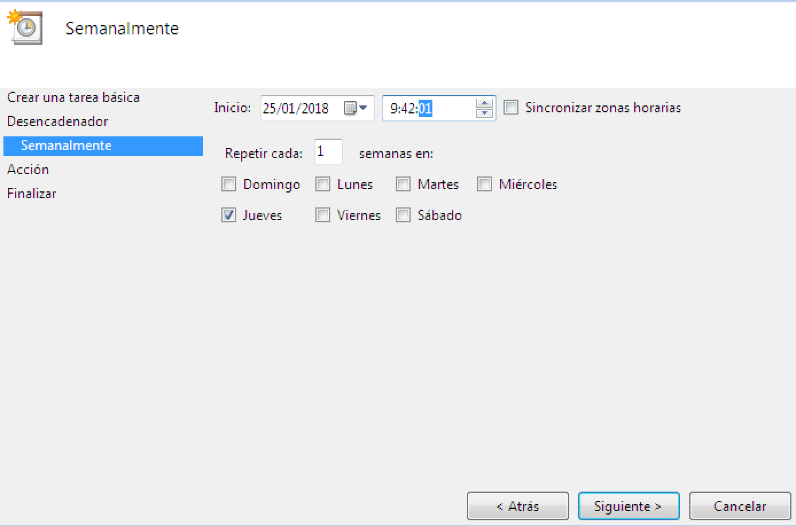

 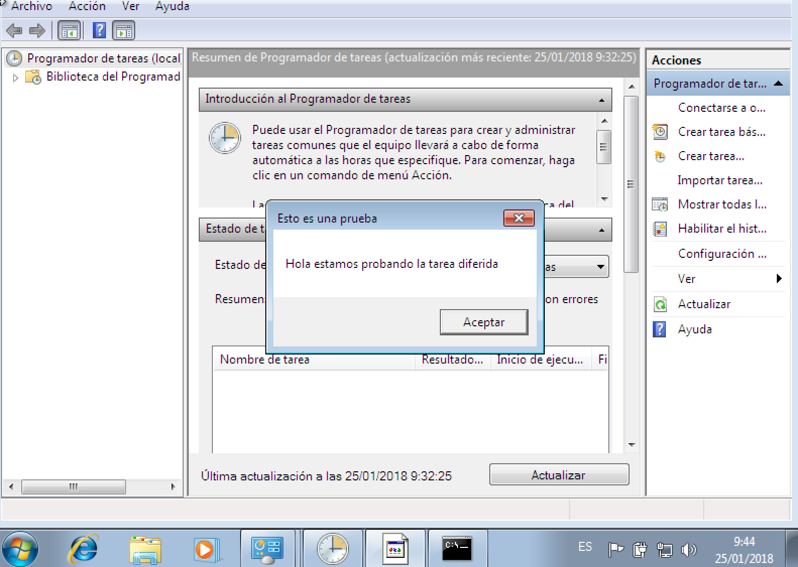

### 2. Windows - Tarea periódica

La tarea programada se define para ejecutarse periódicamente cada intervalo de tiempo.

Vamos a programar una tarea periódica para apagar el equipo.

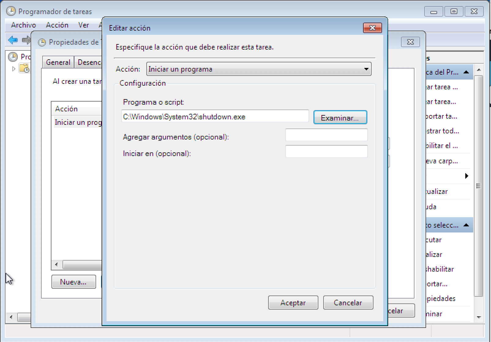

El comando para apagar el sistema es shutdown. shutdown /?, muestra la ayuda del comando.

### 3. SO GNU/Linux - Tarea diferida

El servicio atd es el responsable de la ejecución de los comandos at. Comprobar que esté en ejecución:

Yast -> Servicios
systemctl status atd

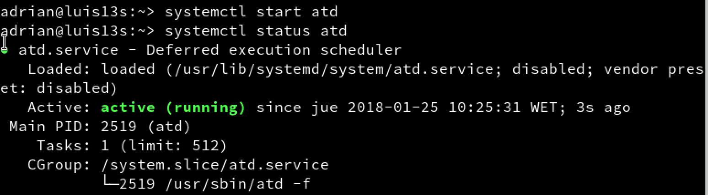

 - Si el usuario no tuviera permisos para ejecutar at, consultar los ficheros: /etc/at.deny y /etc/at.allow.

 - atq, consultamos que no hay ninguna tarea programada.
Ejemplo de script que muestra un mensaje de aviso:

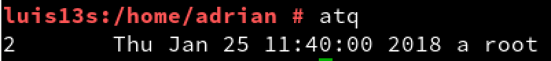

 - Usar comando at para programar una tarea diferida. Por ejemplo para mostrar un mensaje en pantalla.

 - atq, consultamos que SI hay una tarea programada.

 - at -c 1, muestra la configuración del trabajo ID=1.

 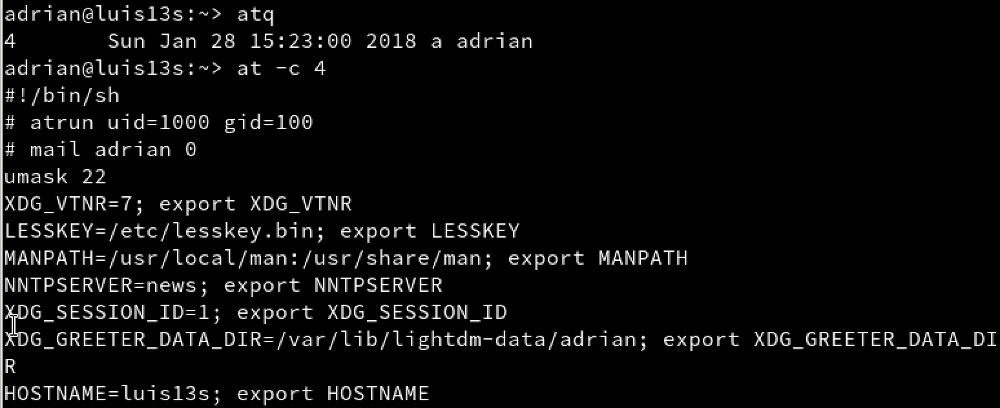

 - Capturar imagen cuando se ejecute la tarea.

 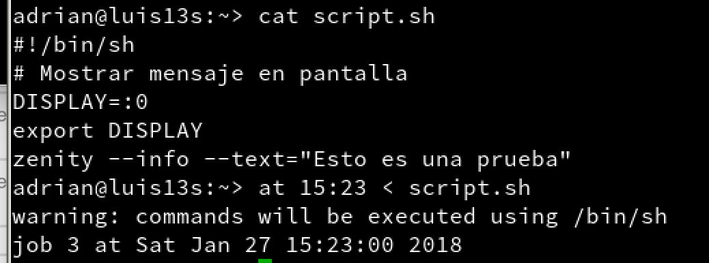

 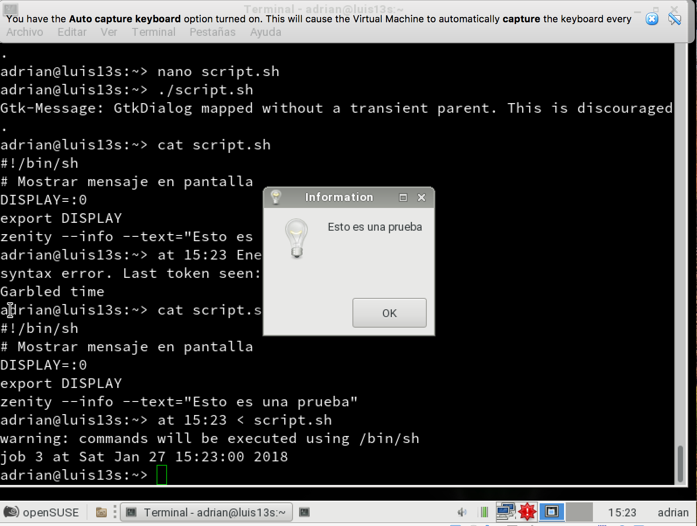

 - atq, consultamos que ya NO hay tareas.

 

### 4. GNU/Linux - Tarea periódica

 - crontab -l, para consultar que no hay tareas programadas.

 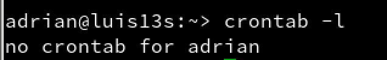

 - Por defecto se usa el editor vim para modificar crontab. Si queremos usar el editor nano, hacemos export VISUAL'nano'.

 - crontab -e, abre el editor para crear una nueva tarea periódica.

 - Definir una tarea periódica (crontab) para apagar el equipo todos los días a una hora/minuto determinada.

 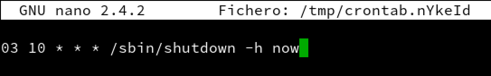

 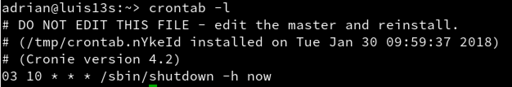

 - Para salir del editor vim, escribimos la secuencia ESC, : y wq.

 - crontab -l, para consultar la tarea que tenemos programada.

 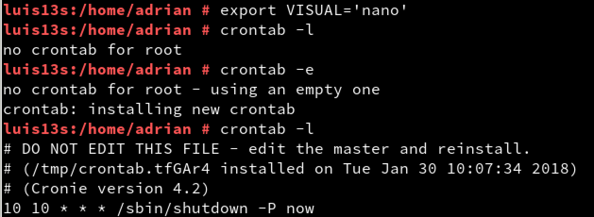
