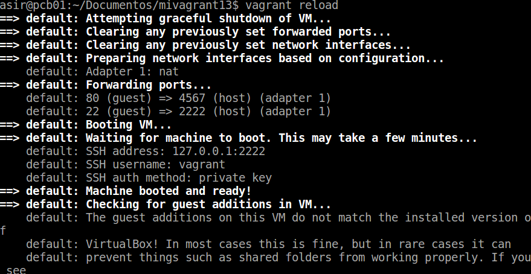
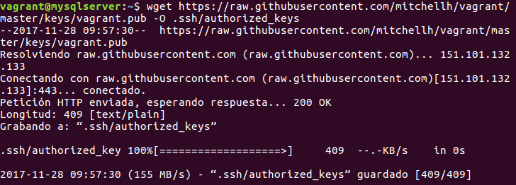

# Vagrant y VirtualBox
## 1. Instalación
Instalamos vagrant en la máquina real utilizando el siguiente comando:
apt-get install vagrant
Para comprobar la versión que tenemos instalada.

## 2. Proyecto

Creamos un directo que utilizaremos para nuestro proyecto.

Hacemos un vagrant init para crear el Vagrantfile y decirle a vagrant que este es el directorio que vamos a utilizar.

## 2.1 Imagen, caja o box

Ahora obtenemos la imagen(caja,box) que vamos a utilizar para crear nuestra máquina.

Ahora cambiamos la configuración del archivo vagrantfile eliminando las líneas comentadas para que sea más facil leerlo. Cambiamos config.vm.box = "base" por config.vm.box = "micaja13_ubuntu_precise32"

Creamos una copia de seguridad por si nos equivocamos podamos recuperar el archivo. Utilizamos el cp para copiar el archivo y cambiarle el nombre.

## 2.2 Iniciar una nueva máquina

Iniciamos una nueva máquina virtuala usando el comando vagrant up:

Utilizamos el comando vagrant ssh para conectarnos por ssh a la máquina virtual.

## 3. Configuración del entorno virtual

Una vez conectados por ssh identificamos las carpetas compartidas dentro del entorno virtual.

## 3.1 Redireccionamiento de los puertos

Instalamos apache.

Modificamos el fichero vagrantfile y añadimos la siguiente línea de modo que el puerto 4567 del sistema anfitrión sea enrutado al puerto 80 del ambiente virtualizado.

Luego hacemos un vagrant reload para recargar la configuración.

Confirmamos que hay un servicio a la escucha en el puerto 4567, ejecutamos los siguiente comandos de la máquina real.

nmap -p 4500-4600 localhost

netstat -ntap

Comprobamos el acceso por navegador web.

## 4. Suministro

Apagamos la máquina y la eliminamos con los siguientes comandos:

## 4.1 Suministro mediante shell script

Creamos el siguiente scrip install_apache.sh dentro del proyecto.

Modificamos vagrantfile y agregamos la siguiente línea.

Volvemos a crear la MV.

Para verificar que efectivamente el servidor Apache ha sido instalado e iniciado comprobamos via web la ip 127.0.0.1:4567

## 4.2 Suministro mediante Puppet

Modificamos el archivo vagrantfile añadiendo la siguientes líneas.

Creamos un fichero llamado default.pp en manifests con las siguiente líneas:

Para aplicar los cambios  eliminamos la máquina y la volvemos a crear.

## 5. Nuestra caja personalizada

## 5.1 Preparar la MV VirtualBox

Utilizamos una máquina reciclada y creamos el usuario vagrant para poder acceder a la máquina virtual por ssh.  Le agregamos una clave pública para autorizar el acceso sin clave desde vagrant.(Instalamos openssh-server si no lo tenemos instalado)

Ponemos la clave vagrant al usuario vagrant.

Añadimos vagrant ALL=(ALL) NOPASSWD: ALL a /etc/sudoers.

Nos aseguramos que tenemos instalado las VirtualBox Guest Additions con el siguiente comando:

## 5.2 Crear la caja vagrant

Creamos una nueva carpeta mivagrant13conmicaja.

# FALTA

Ejecutamos vagrant init para crear el fichero de configuración nuevo.

Localizamos el nombre de nuestra máquina(ubuntu-mysql)

Creamos la caja package.box a partir de la MV.

Comprobamos que se ha creado la caja.

Añadimos la nueva caja que hemos creado como una nueva máquina virtual.

Hacemos el vagrant init dentro de la carpeta de la nueva máquina y modificamos el vagrantfile que se crea para que utilice la nueva máquina.

Iniciamos la máquina.

Y nos conectamos por ssh con vagrant ssh.

